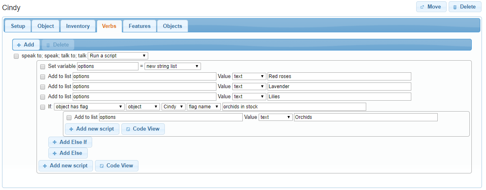
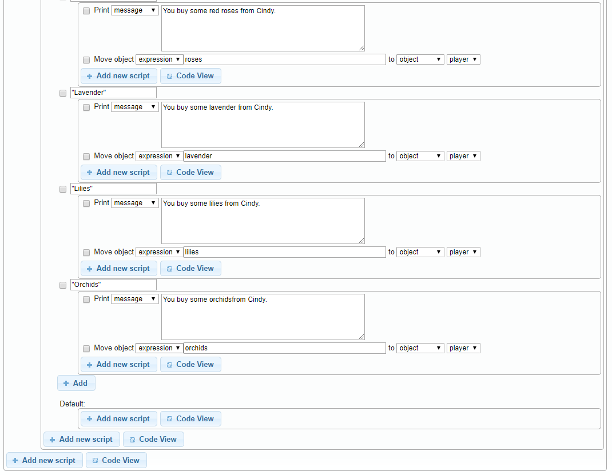
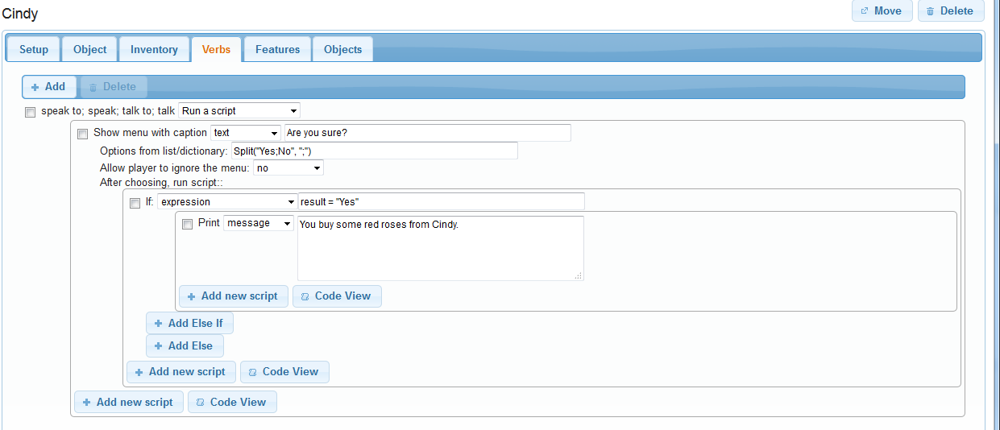

You will often find you want to ask the player a question. You might want to ask if the player wants to play as a man or a woman, or perhaps there is a point in the game where a character asks a question.

We will look at asking simple questions here, and by that I mean a question with a limited number of responses that are presented as a menu. Such questions are simple because we know how the player will respond. Handling a question where the player can type in anything is more complicated and discussed [elsewhere](asking_a_question.html).

There are four parts to the process. First we have to decide what will prompt the question, then we need to get the options for the menu, then we show the menu, and finally we need to handle the response.


What prompts the question?
--------------------------

There are all sorts of triggers, and we cannot address them all here, but here are some examples.

**Start of the game:** If you want ask if the player wants to play as a man or a woman, then you need to do it right at the start. Go to the game object at the top on the left, and the _Scripts_ tab on the right. At the top of the tab is the "Start script".

**Entering a room:** Perhaps a character asks a question as soon as the player enters a room. Go to the _Scripts_ tab of the room, and look for the "After entering the room for the first time" bit.

**When an item is taken or dropped:** Go to the _Inventory_ tab of the object, and look for the "After taking the object" or "After dropping the object" bit (ensure the box is ticked to allow it to be taken or dropped).

**Verbs:** A common use is when the player talks to a character. Talking can be done as a verb, so go to the _Verbs_ tab of the character, start typing in "speak", and select the option when it appears. Set it to run a script.

**Commands:** For a command, just go to the script of the command.

**Others:** For other triggers, you are on your own, but think about what item or room is involved, and go to that, and look at what tab seems most appropriate; what scripts are available?


Collecting the options
----------------------

Each option you give the player must go into a string list, so the first thing to do is create a new string list. Click "Add new script", and select "Set a variable or attribute". In the first text box, type "options" (no quotes), and from the drop-down, select "new string list".

Now we can add the options to the list. For each option, Click "Add new script", and select "Add a value to a list". In the first text box, type "options", in the drop-down select "text", and in the second text field type in your option.

Here is an example, setting up a character called Cindy as a flower seller. This is for when the player talks to her, so is set up as a verb. Three options have been added.


In some situations, you might want to vary the list. There are various ways to do that, but the easiest is just to add an `if` to the script. Have the `if` command check if the option should be added (are orchids in stock), and if so, add that option to the list.




Show the menu
-------------

Click "Add new script", and select "Show a menu". In the first textbox, type in the question you want to ask the player. In the second, type in "options" to tell it to use the list of options we created before. You can also choose whether the player can ignore the menu. If this is asking the player whether to be a man or a woman, you would want to set this "no" to ensure the player makes a choice. For our flower seller, we can leave it as "yes"; if the player decides the flowers on offer are not that good, she can just ignore the menu and do something else.


At this point you should be able to go into the game and actually see the menu work - though it will not do anything.


Handle the response
-------------------

So now we need to handle the response. You will see you now have two "Add new script" buttons. You need to be using the upper one, indented to the right. This will ensure the scripts you add will be run after the choice is made.

When the player makes a choice, that option goes into a variable called "result", and we are going to check that to decide what to. The best way to do that is with a `switch`. Click "Add new script", and select "Switch". In the text box, type in "result".

Click "Add" and type in the first of your options. Note that this must be exactly the same as you had it in the option, with the same capitalisation, otherwise it will not get matched, and copy-and-paste is a good idea. You also need to put double quotes at the start and end.

You will see you have yet another "Add new script" - this one specifically for this option. Add scripts as appropriate - exactly what is up to you. In the example below, it just prints some text.


You need to do that for each option. Below you can see it has been done for two, I still need to do the third!


If you have variable options (for example, the option to buy orchids is only there if the flower seller has them in stick), that is no problem. You just need to make sure there is a `case` for all of them. You do not need to check the condition again or check that the option was in the list. The player will only be able to make that choice if it was in the list, and it will only be in the list if it is allowed. Below I have added both lilies and orchids, and also move the relevant object to the player. It is starting to get long, so only the lower half of the script is shown:




In code?!?
----------

It is worthwhile looking briefly at the code view:

```
options = NewStringList()
list add (options, "Red roses")
list add (options, "Lavender")
list add (options, "Lilies")
if (GetBoolean(Cindy, "orchids in stock")) {
  list add (options, "Orchids")
}
ShowMenu ("What flowers do you want to buy?", options, true) {
  switch (result) {
    case ("Red roses") {
      msg ("You buy some red roses from Cindy.")
      MoveObject (roses, player)
    }
    case ("Lavender") {
      msg ("You buy some lavender from Cindy.")
      MoveObject (lavender, player)
    }
    case ("Lilies") {
      msg ("You buy some lilies from Cindy.")
      MoveObject (lilies, player)
    }
    case ("Orchids") {
      msg ("You buy some orchidsfrom Cindy.")
      MoveObject (orchids, player)
    }
  }
}
```

If you look through it you should see each set that we added is there, in the same order. The code is just a different way of looking at the same thing.


Note 1: Yes or no?
-------------------

For simple questions, we can shortcut some of that. We can use the `Split` function to make the string list, and just check for one value for `result`. For example:



In code:

```
ShowMenu ("Are you sure?", Split("Yes;No", ";"), false) {
  if (result = "Yes") {
    msg ("You buy some red roses from Cindy.")
  }
}
```

You can also use the `Ask` function - see [here](functions/ask.html).


Note 2: Code after will run immediately
-----------------------------------------

If you have any script after the ShowMenu, this will run straightaway, without waiting for the player to make a choice. Consider this example:

```
options = NewStringList()
list add (options, "Red roses")
list add (options, "Lavender")
list add (options, "Lilies")
ShowMenu ("What flowers do you want to buy?", options, true) {
  switch (result) {
    case ("Red roses") {
      msg ("You buy some red roses from Cindy.")
    }
    case ("Lavender") {
      msg ("You buy some lavender from Cindy.")
    }
  }
}
msg("'Have a nice day!' she says.")
```

Quest will set up the string list, display the menu, but will then print "'Have a nice day!' she says." immediately, whilst another part waits for the player to make a choice. That is probably not what you want! This is how to do it properly:

```
options = NewStringList()
list add (options, "Red roses")
list add (options, "Lavender")
list add (options, "Lilies")
ShowMenu ("What flowers do you want to buy?", options, true) {
  switch (result) {
    case ("Red roses") {
      msg ("You buy some red roses from Cindy.")
    }
    case ("Lavender") {
      msg ("You buy some lavender from Cindy.")
    }
  }
  msg("'Have a nice day!' she says.")
}
```


Note 3: No local variables
---------------------------

The script that runs inside of ShowMenu when the player makes a choice has no access to local variables. It will not know what `this` is, and if in a command will not know what `object` (or whatever) is.

For example, suppose the above script is an attribute of Cindy, we could try this:

```
options = NewStringList()
list add (options, "Red roses")
list add (options, "Lavender")
list add (options, "Lilies")
ShowMenu ("'What flowers do you want to buy?' asks " + GetDisplayAlias(this) + ".", options, true) {
  switch (result) {
    case ("Red roses") {
      msg ("You buy some red roses from " + GetDisplayAlias(this) + ".")
    }
    case ("Lavender") {
      msg ("You buy some lavender from " + GetDisplayAlias(this) + ".")
    }
  }
  msg("'Have a nice day!' she says.")
}
```

The 'What flowers do you want to buy?' bit will be okay, `this` will refer to Cindy, as the script belongs to her. However, the bits inside the `ShowMenu` will fail, because that is a different script; it does not belong to Cindy, so `this` does not refer to anything.

The way to get around that is to assign the value to an attribute of the game or player object (you can use the same one for all your `ShowMenu` calls, as it is only needed temporarily.

```
options = NewStringList()
list add (options, "Red roses")
list add (options, "Lavender")
list add (options, "Lilies")
game.show_menu_this = this
ShowMenu ("'What flowers do you want to buy?' asks " + GetDisplayAlias(this) + ".", options, true) {
  switch (result) {
    case ("Red roses") {
      msg ("You buy some red roses from " + GetDisplayAlias(game.show_menu_this) + ".")
    }
    case ("Lavender") {
      msg ("You buy some lavender from " + GetDisplayAlias(game.show_menu_this) + ".")
    }
  }
  msg("'Have a nice day!' she says.")
}
```


