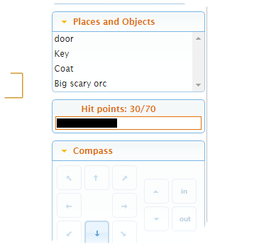

The Custom Status Pane is an extra pane you can add to those on the right, that you can use to show pretty much anything. A knowledge of HTML and CSS will be useful here.

On the _Interface_ panel of the game object, make sure "Show Panes" is ticked, then tick "Show a custom status pane". If you start your game, you should see the new pane, but it just says "Status" and does not do anything.

We need to use the `JS.setCustomStatus` function, which can take one parameter, a string to display. Here is an example:

```
JS.setCustomStatus ("You are fine!")
```

At this point, you may wonder why bother? The power of the custom status pane comes from using it with HTML. This allows you to format the string to show the information nicely. Here is an example that displays the player's status in a neat table. 

```
html = "<table><tr><td width=\"50%\">Condition:</td><td>Poisoned</td></tr><tr><td></td><td>Woozy</td></tr></table>"
JS.setCustomStatus (html)
```

In your game, you would want to re-build the string whenever a attribute changes. Here is some example code that will take a string list of conditions, called "list", and display it in a table as in the previous example:

```
s = "<table><tr><td width=\"50%\">Condition:</td><td>"
s = s + Join(list, "</td></tr><tr><td></td><td>")
s = s + "</td></tr></table>"
JS.setCustomStatus (s)
```

Note that the string, `s`, is built up step-by-step, and then we do something with it at the end. You could do all this in one long line, but it is much easier to read and understand this way.


### Indicator bar

So how about a graphical representation of the player's hits, a horizontal bar that shows the proportion of her hits she has remaining... We can do that!



We are going to have two attributes here, the player's current "hitpoints" and their maximum, "maxhitpoints". We will set up an HTML table again, but the second row will be the indicator; a `span` element with a `padding-right` attribute that will be adjusted as hits change.

We need this to happen when the game starts and when reloaded, so this needs to go in the "inituserinterface" script as before. Here is the code for the "inituserinterface" script:

```
s = "<table width=\"100%\"><tr>"
s = s + "   <td style=\"text-align:right;\" width=\"50%\">Hit points:</td>"
s = s + "   <td style=\"text-align:left;\" width=\"50%\"><span id=\"hits-span\">---</span></td>"
s = s + " </tr>"
s = s + " <tr>"
s = s + "   <td colspan=\"2\" style=\"border: thin solid;background:white;text-align:left;\">"
s = s + "   <span id=\"hits-indicator\" style=\"background-color:black;padding-right:200px;\"></span>"
s = s + "   </td>"
s = s + " </tr>"
s = s + "</table>"

JS.setCustomStatus (s)
if (HasScript(player, "changedhitpoints")) {
  do (player, "changedhitpoints")
}
```

The first ten lines set up the HTML (each line is adding a bit more to the string, `s`). There are two `span` elements, called "hits-span" and "hits-indicator", and these are what will get updated.

The next line dumps the HTML in the custom status pane.

The last three rooms update the values - but only if player.changedhitpoints has been set, i.e., when reloading.

And then in the "start script" (go to the _Scripts_ tab of the game object):

```
player.changedhitpoints => {
  JS.eval ("$('#hits-span').html('" + game.pov.hitpoints + "/" + game.pov.maxhitpoints + "');")
  JS.eval ("$('#hits-indicator').css('padding-right', '" + (200 * game.pov.hitpoints / game.pov.maxhitpoints) + "px');")
}

player.maxhitpoints = 70
player.hitpoints = 70
```

The first four lines here add a change script to the "hitpoints" attribute of the player. This will fire whenever the hits change (you might want to add a bit that makes the player die if they dip below zero). The "hits-span" part just changes the text, but the "hits-indicator" sets a new value for the right padding of the `span`, making it wider or narrower as required.

The last two lines set the hit points and the maximum. Note that the hit points must be set last so that when they change, the custom status pane will be updated correctly.


### Multiple indicators?

You can have the pane show several indicators. This is the code for three, showing hit points, armour and magic.


```
s = "<table width=\"100%\">"
s = s + " <tr>"
s = s + "   <td style=\"text-align:right;\" width=\"50%\">Hit points:</td>"
s = s + "   <td style=\"text-align:left;\" width=\"50%\"><span id=\"hits-span\">---</span></td>"
s = s + " </tr>"
s = s + " <tr>"
s = s + "   <td colspan=\"2\" style=\"border: thin solid;background:white;text-align:left;\">"
s = s + "   <span id=\"hits-indicator\" style=\"background-color:black;padding-right:200px;\"></span>"
s = s + "   </td>"
s = s + " </tr>"
s = s + " <tr>"
s = s + "   <td style=\"text-align:right;\" width=\"50%\">Armour:</td>"
s = s + "   <td style=\"text-align:left;\" width=\"50%\"><span id=\"armour-span\">---</span></td>"
s = s + " </tr>"
s = s + " <tr>"
s = s + "   <td colspan=\"2\" style=\"border: thin solid;background:white;text-align:left;\">"
s = s + "   <span id=\"armour-indicator\" style=\"background-color:black;padding-right:200px;\"></span>"
s = s + "   </td>"
s = s + " </tr>"
s = s + " <tr>"
s = s + "   <td style=\"text-align:right;\" width=\"50%\">Magic points:</td>"
s = s + "   <td style=\"text-align:left;\" width=\"50%\"><span id=\"magic-span\">---</span></td>"
s = s + " </tr>"
s = s + " <tr>"
s = s + "   <td colspan=\"2\" style=\"border: thin solid;background:white;text-align:left;\">"
s = s + "   <span id=\"magic-indicator\" style=\"background-color:black;padding-right:200px;\"></span>"
s = s + "   </td>"
s = s + " </tr>"
s = s + "</table>"

JS.setCustomStatus (s)
if (HasScript(player, "changedhitpoints")) {
  do (player, "changedhitpoints")
}
```

You will need to also modify the game.start script so these two indicators also get updated.