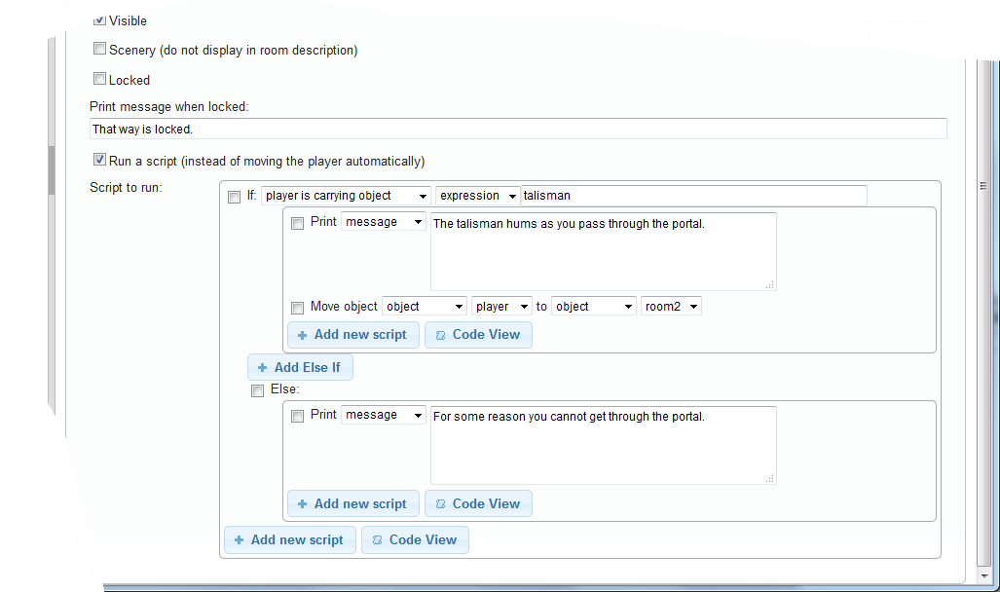
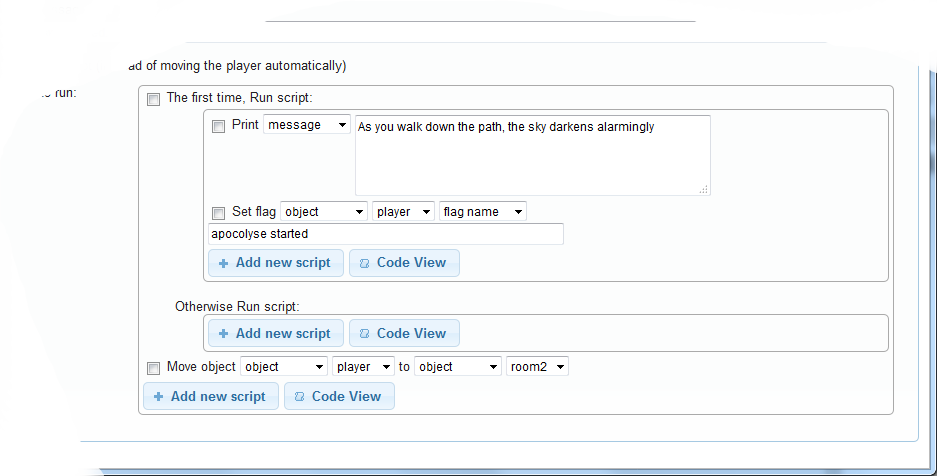

Exits are dead easy to set up in Quest. Go to the _Exits_ tab of the room, click the direction, select a destination, choose if you want to also create a reverse exit and click "Create exit".

Like everything else in Quest, an exit is an object, and your exit will appear in the left hand pane, under the room (you may need to expand the node to see it).

We will start by looking at the various settings for an exit.


To
-----------

The "To" dropdown determines where the exit will take the player.

When you create a room, you will find you cannot create an exit that goes to the room it came from. However, once the exit is created, you can change its destination to any room (or object), including the same room.


Type vs alias
-------------

Quest uses the alias of the exit to decide which direction it is. The type is used when the exit is created, but does not really do anything once that has happened (it does provide an alternative name, if the alias is "east" and the type is "north", then the exit will get used for EAST, E and N).

In the desktop version you can set the alias to any value you like, so you could have "kitchen" as a direction (you could do this in the web version by setting the exit alias in the start script, but it will be a pain if you do this for all the exits in your game). Note that the exit will then appear in the list of "Places and Objects" rather than the compass. Set the type to "Non-directional exit".


Prefix and Suffix
-----------------

This is text that will get added to the direction in the list of exits for the room description. For example, if you have an exit going south, you could add the prefix "through an arched doorway to the" and when the player sees the room description, she will see:

> You can go through an arched doorway to the south.

Note that if you are using hypertext links, only the alias will be a link, not the prefix or suffix.

If you are using names instead of directions, you might want to have a prefix like "to the", so the player sees:

> You can go to the kitchen.


Name
----

A name is optional for an exit (if you do not give the exit a room, Quest will when the game starts). However, if you want to change any attribute of the exit during play (say to unlock it), you will need a name to refer to it by.


Locked vs Visible vs Scenery
-----------------------------

An exit that is not **visible** will not appear in the compass rose or room description, and cannot be used. As far as the player is concerned, it does not exit.

Having an exit invisible is a great way of making an exit during the game. Suppose the explosion has created a new opening through the wall. Rather than create a new exit during the game, it is far easy to have the exit already created in the editor, and just set it to be visible at the explosion.

An exit that is **locked** will be listed in the room description, and will be visible in the compass rose, but the player will not be able to use it (she will see the locked message instead).

An exit flagged as **scenery** will not be listed in the room description, and will not be visible in the compass rose, but the player will still be able to use it.

If you have a flight of stairs heading up to the east, the player might type UP or EAST, so you need to be able to handle both. However, if the room description lists both up and east as exits, the player will think they are different exits. The solution is to flag one as scenery.


Print message when used
------------------------

By default, Quest does not print anything when an exit is used, and just gives the details of the new room. You can use this text field to have a message when the player heads that way.


Attributes
----------

To change the state of an exit during a game, we need to change its attributes. Actually, that is what we were changing with all the setting above, but during a game you need to do that with a script.

As mentioned before, you need to give your exit a name to be able to do this. Say we have an exit called "exit to kitchen" (lines that start with two slashes are comments by the way)...

```
// lock the exit
exit to kitchen.locked = true

// unlock the exit
exit to kitchen.locked = false

// make the exit appear
exit to kitchen.visible = true

// have the exit go to the garden object
exit to kitchen.to = garden
```


Exit script
-----------

You can have an exit run a script when the player uses it. Tick the "Run a script" check box to activate the script, and an area for the script will appear.

There are any number of reasons why you might want to run a script, so we can only look at a few examples. Note that by default the player will not be moved if we have "Run a script"; if we want the player to go to the new room, we need to do that in the script.

### Conditional move

A common reason to run a script is to only allow the exit to be used if a certain condition is met. Perhaps the player has to complete a quest before the portal opens, or needs to be carrying the magical amulet or has to have persuaded the guard to let her pass.



```
if (Got(talisman)) {
  msg ("The talisman hums as you pass through the portal.")
  MoveObject (player, room2)
}
else {
  msg ("For some reason you cannot get through the portal.")
}
```

The basic principle is that we test the condition. If the condition passes, then we print a message, and move the player (it is important to do the message first, as moving the player will cause the room description to get printed, and you want the message before that). If the condition fails, just give a message.

This is very much like having the exit locked, so when would you use this, rather than unlocked? This technique is best for checking an on-going situation, so in fact whether the player is carrying a key is actually better done this way. The "locked" attribute is better for specific events, such as the player using the UNLOCK command...  Hmm, turns out setting up a locked door is pretty involved, but is discussed in detail [here](setting_up_door.html).


### Move and...

You might the player to trigger some event by using the exit.



```
firsttime {
  msg ("As you walk down the path, the sky darkens alarmingly ")
  SetObjectFlagOn (player, "apocolyse started")
}
MoveObject (player, room2)
```

In this instance, we only want it to happen once, so we use the `firsttime` script command. Again, we need the message to appear before the room description, so we move the player in the last line.


### Using `this.to`

Rather than using a specific destination in your scripts, it can be a good idea to use `this.to` instead. `this` is a special value in Quest that refers to the object the script is attached to (i.e., the exit), and the "to" attribute is the destination of an exit. This means you can potentially use the same script for different exits to different destinations. It also means that if you later modify your game and change the destination of an exit, your script will still work fine; it will send the player to the new destination without you having to remember to update the script. It is probably less typing too!


Room scripts
------------

It is worth briefly mentioning room scripts. Rooms have a number of scripts that fire in different situations; before entering, after entering, when leaving, etc. Do not be tempted to move the player in any of these scripts; it will confuse Quest, and the output will confuse you.

So what if you want to trap the player in a room with several exits?

The best way is to set all the exits to be either locked or invisible. In this example, we will set all the exits in the current room to be locked, using a `foreach` command. To unlock them all again, just set the attribute to `false`.


```
foreach (ext, ScopeExits ()) {
  ext.locked = true
}
```

Note that `ext` is a local variable. Do not be tempted to use `e` as a local variable for an exit (or anything else); this is a built-in constant and cannot be set to anything (though Quest will fail to tell you that!).


Useful Functions
----------------

### Creating exits on the fly

Sometimes the tricking of setting a exit to be visible is not going to work, and you really need to create an exit. Quest has the [create exit](scripts/create_exit.html) script command for just this purpose. If you want to create an exit going the other way at the same time, we have the [CreateBiExits](functions/createbiexits.html) function.

### Finding an exit

To find a specific exit, use [GetExitByLink](functions/getexitbylink.html) to get the exit from one room to another or [GetExitByName](functions/getexitbyname.html) to get the exit from a room in a specific direction (uses the alias of the exit). These both return the name of the exit (or `null` if there is none). Use `GetObject` to get the exit itself.

```
exitname = GetExitByName(room2, "north")
if (not exitname = null) {
  ext = GetObject(exitname)
  msg ("The exit north goes to " + ext.to.name + ".")
}
else {
  msg ("No exit north")
}
```

### Finding exits

There are three scope functions that will return a list of exits for a given room. 

- [ScopeExits](functions/corelibrary/scopeexits.html) All visible exits for current room
- [ScopeExitsForRoom](functions/corelibrary/scopeexitsforroom.html) All visible exits for the given room
- [ScopeUnlockedExitsForRoom](functions/corelibrary/scopeunlockedexitsforroom.html) All visible and unlocked exits for the given room


### Random exit

Two functions, [PickOneExit](functions/pickoneexit.html) and [functions/pickoneunlockedexit.html](functions/pickoneunlockedexit.html), will give a random exit from the given room (or `null` if there are none).