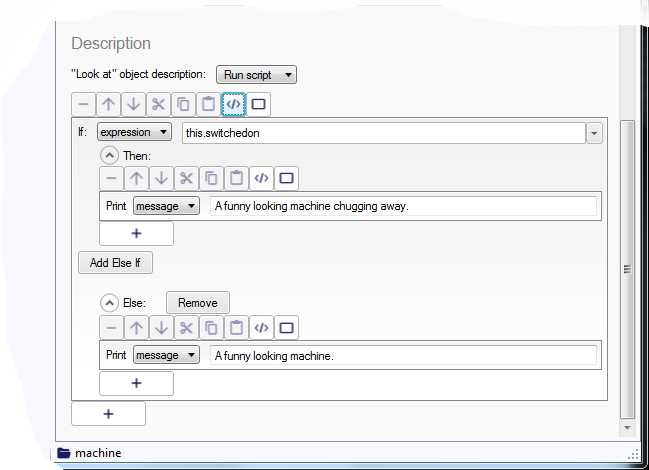
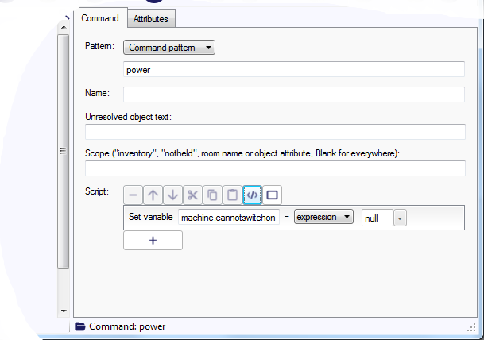
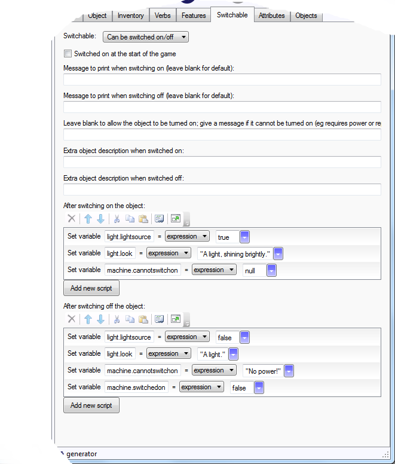
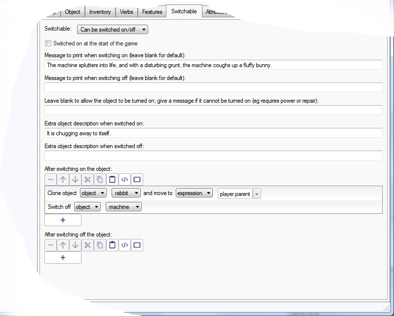
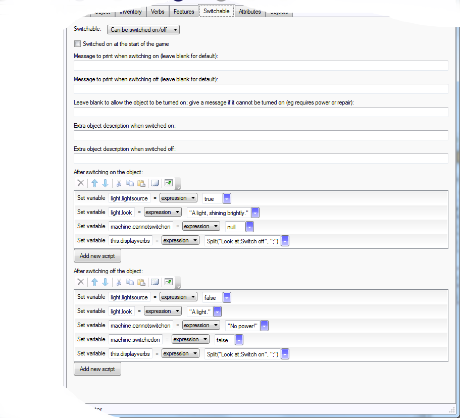

In a world of electronic goods, items that can be turned on and off are very common. How would you implement that in Quest?

Let's create an object called "machine", and do just that!

Switchable
----------

On the _Features_ tab, of the object, tick "Switchable:...", and then go to the _Switchable_ tab. Select "Can be switched on/off". Various options will appear that you can fill in as you see fit, or just leave blank:


Descriptions
------------

Let us say the machine has a description that is text, and says "A funny looking machine." With the values set above, when the machine is looked at, the player will see "A funny looking machine." when it is turned off, and "A funny looking machine. It is chugging away to itself." when it is turned on.

Yon can sometimes get better prose using the text processor, as you are not limited to tacking a sentence on the end. Make the two "Extra object description..." fields blank, and have the description (_Setup_ tab) like this:

```
A funny looking machine{if machine.switchedon: chugging away}.
```

This uses the "switchedon" flag (or Boolean attribute) of the object, which Quest will set to true when the object is switched on.

For complex descriptions, you may have to use a script, instead of text, and in that case the two "Extra object description..." fields will be ignored. Again the text processor is a solution:

```
msg ("A funny looking machine{if machine.switchedon: chugging away}.")
```

Or an `if` command. This is a trivial example, but could be much more complicated. Note that "this" is a special variable that means the object the script belongs to (it cannot be used with the text processor unfortunately).



```
if (this.switchedon) {
  msg ("A funny looking machine chugging away.")
}
else {
  msg ("A funny looking machine.")
}
```


It won't turn on!
---------

Switchables can be given a special attribute, "cannotswitchon", that will indicate it cannot be turned on - for example, there is no power or it needs a part or needs repairing. You can set this in the third text field on the _Switcheable_ tab. In your game, you will need to set this to null at some point - when the device has power, perhaps.

In this simple example, the player just has to use a new POWER command to get power to the machine:



This is the code:

```
machine.cannotswitchon = null
```

If the object becomes unuseable (perhaps the power is turned off), just set the "cannotswitchon" attribute to some appropriate string. Remember to also turn the machine off, by setting its "switchedon" attribute to false.

Note that using the "After switching on the object" script is not a good option in this case, as Quest will report that the object has switched on before running the script; the player would see, "You turn the machine on. You can't turn it on, it has no power."


Doing something
---------------

So it is great that we can turn it on and off, but so what? How does that impact the game world? There are two approaches here. The first is to have other systems check if the object is on or off. A simple example might be checking if a generator is turned on, before allowing something else to work. This is best done by checking the "switchedon" attribute of the machine.

Suppose we have a crystal ball that can be used only when our machine is turned on, we could set it up like this:


```
if (machine.switchedon) {
  msg ("You consult the crystal ball, and learn all sorts of stuff.")
}
else {
  msg ("The crystal ball is dark for some reason.")
}
```

Alternatively, you could have the machine change the state of another object - or as many objects as you like. Let us say we have a new switchable object, a generator. This is connected to our machine and to a light (for details on using light and dark in your game, see [here](handling_light_and_dark.html)).

In this case the turning-on script for the generator needs to change the state of the other objects affected; for the light, we need to set it as a light source and update the description. For the machine, we need to set the "cannotswitchon" attribute to null to allow it to be turned on.

For the turn off script, we need to reverse all that. We have some extra house keeping to do, as the machine may be turned on, we need to ensure it is turned off.



The turn on code:

```
light.lightsource = true
light.look = "A light, shining brightly."
machine.cannotswitchon = null
```

The turn off code:


```
light.lightsource = false
light.look = "A light."
machine.cannotswitchon = "No power!"
machine.switchedon = false
```

You might also want to put some text in there to let the play know these things have happened. Here is an example that checks if the machine is on (before turning it off!), and if it is, gives a message:

```
light.lightsource = false
light.look = "A light."
machine.cannotswitchon = "No power!"
if (machine.switchedon) {
  msg("The machine stops when the power fails.")
}
machine.switchedon = false
```


So which is the best approach for you? If you want to test if the object is switched on for something happening instantly, like using the crystal ball, the first approach is best. It is probably the safest way, in the sense that the state of the object is in one place only, so your game cannot get in a state where one thing thinks it is turned on and another thinks it is turned off.

However, the second approach is easy for on-going situations, such as the light; the light will continue to give light as long as the generator is on.


On for a moment
---------------

Occasionally you might want to implement a machine that the player turns on, it does something straight away, and then is off again.

Let us suppose our machine will clone rabbits. We need to add a script that does two things; clone the rabbit and switch the machine back off. Note that in this case we do not need a message when the player turns the machine off.



```
CloneObjectAndMove (rabbit, player.parent)
SwitchOff (machine)
```

Or change the attribute directly:

```
CloneObjectAndMove (rabbit, player.parent)
machine.switchedon = false
```

It is also a good idea to go to the _Object_ tab and delete "Switch off" from the two lists at the bottom.


Better Display Verbs
--------------------

In fact, it will look better if the player only sees "Switch on" when the object is off, and "Switch off" when it is on.

We will do this for the generator. The generator cannot be picked up, so we only need to worry about the display verbs. As it starts turned off, on the _Object_ tab delete "Switch off" and "Take" from the list of display verbs at the bottom.

Then go to the _Switchable_ tab, and set it to change the display verbs when turned on and off:



```
light.lightsource = true
light.look = "A light, shining brightly."
machine.cannotswitchon = null
this.displayverbs = Split("Look at;Switch off", ";")
```

```
light.lightsource = false
light.look = "A light."
machine.cannotswitchon = "No power!"
machine.switchedon = false
this.displayverbs = Split("Look at;Switch on", ";")
```

### Portable objects...

If the object can be picked up, then you need to modify the inventory verbs, and include the "Take" and "Drop" verbs. Delete just "Switch off", but from both lists at the bottom of the _Object_ tab. The code on the _Switchable_ tab would then look like this:

```
light.lightsource = true
light.look = "A light, shining brightly."
machine.cannotswitchon = null
this.displayverbs = Split("Look at;Take;Switch off", ";")
this.inventoryverbs = Split("Look at;Drop;Switch off", ";")
```

```
light.lightsource = false
light.look = "A light."
machine.cannotswitchon = "No power!"
machine.switchedon = false
this.displayverbs = Split("Look at;Take;Switch on", ";")
this.inventoryverbs = Split("Look at;Drop;Switch on", ";")
```

### Remember...

If your object can be turned off another way, you will need to update the display verbs there. For the machine powered by the generator, when the generator is turned off, we would have to also update the verbs for the machine.

```
light.lightsource = false
light.look = "A light."
machine.cannotswitchon = "No power!"
machine.switchedon = false
machine.displayverbs = Split("Look at;Switch on", ";")
this.displayverbs = Split("Look at;Switch on", ";")
```

Testing
-------

It is vital that you test your switchable objects, as there is potential for weird bugs.

What happens if the player switches it on three times in a row, or off three times in a row or on and off three times in a row. Do display verbs and descriptions change as they should. What happens if the player turns things on out of the expected sequence?

Note that you can move the player object to the same room as the switchable object whilst you test. When you are sure it works as expected, move the player object back to its normal place.