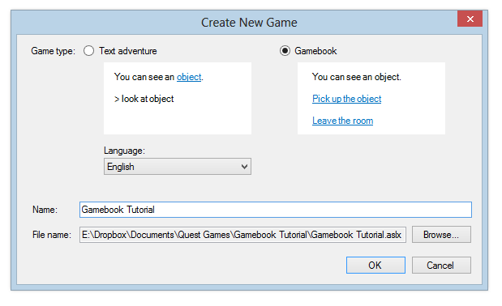
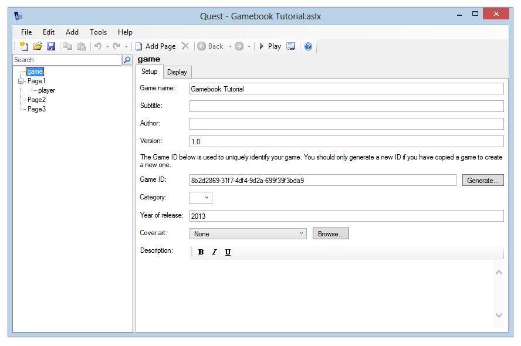
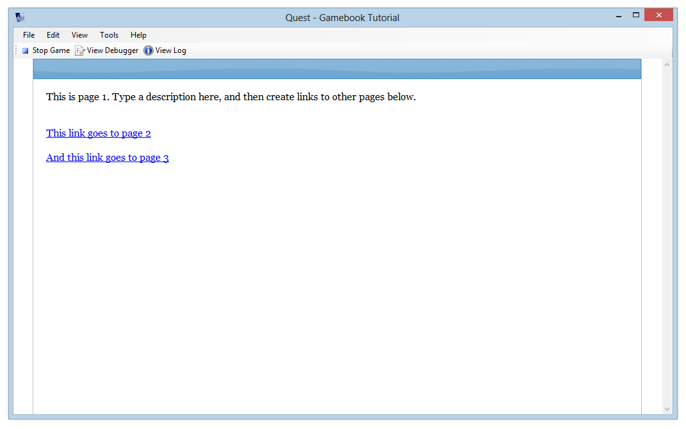
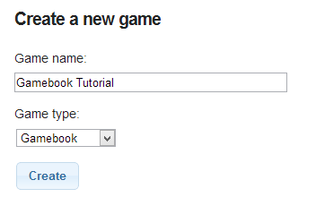
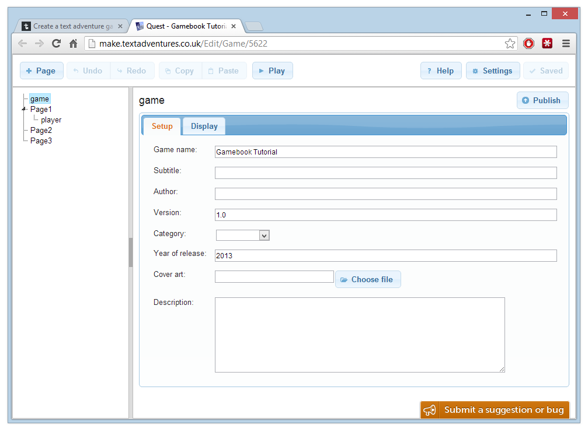

NOTE: _Rather than using the Game Book feature of Quest, we would suggest you use either the full product (and turn off the game panes and command bar so the player just uses hyperlinks), or use [Squiffy](http://docs.textadventures.co.uk/squiffy/). Quest Text Adventures have a full world model, where objects and rooms relate to each other in a meaningful way, and have numerous features not supported by Game Books. Squiffy has no world model, but is great for creating multiple choice games that focus on text and story, and will produce a game that can be run in any browser, without the need for a dedicated server. Quest Game Books represent the worst of both worlds._

Creating a blank game
---------------------

Most of the tutorial is applicable to both the Windows desktop version of Quest, and the web version. Any differences in the two versions will be mentioned as we go along.

This tutorial guides you through creating your first gamebook game. If you want to create a text adventure instead, see [the main Quest tutorial](tutorial.html).

### Windows desktop version

To create a new game, open Quest and click the File menu, then Create New Game.

Alternatively, you can switch to the Create tab and click the "Create a new game" button.

You'll see a screen like this:

Ensure that "Gamebook" is selected, and enter a name like "Tutorial Game". Quest will create a folder and a game file for you. You can change where it puts the file by clicking the "Browse" button - it is recommended that you put your game file in its own folder.

Click OK and you'll see the main Editor screen:

On the left is a tree showing you the pages in the gamebook, and a place to set options about the game itself. "Game" is currently selected, so that's what we can see in the pane on the right.

Quest has created three example pages for us, and inside Page1 is the "player" object, which is where the game begins. You can test the game by clicking the "Play" button on the toolbar, or "Play Game" from the File menu. You can also press the F5 key.

As you'll see, it's a pretty empty game at the moment. We can navigate to pages 2 and 3, but that's it.

You can go back to the Editor by clicking "Stop Game" in the top left of the screen. (You can hit the Escape key)

### Web version

To create a new game, [log in to Quest](http://textadventures.co.uk/create/). You'll see the "New game" form.

Ensure that "Gamebook" is selected. Enter a name like "Tutorial Game" and click the "Create" button. Click the link which appears, and you'll see the main Editor screen.

On the left is a tree showing you the pages in the gamebook, and a place to set options about the game itself. "Game" is currently selected, so that's what we can see in the pane on the right.

Quest has created three example pages for us, and inside Page1 is the "player" object, which is where the game begins. You can test the game by clicking the "Play" button at the top of the screen. The game will open in a new browser tab or window.

As you'll see, it's a pretty empty game at the moment. We can navigate to pages 2 and 3, but that's it.

Simple Mode
-----------

When starting out with Quest, you may find it easier to run in "Simple Mode". This hides much of Quest's more advanced functionality, but still gives you access to the core features.

You can toggle Simple Mode on or off at any time:

-   on the Windows desktop version, you can toggle Simple Mode from the Tools menu.
-   on the web version, click the Settings button at the top right of the screen.

Editing pages
-------------

To create your game, edit the text for Page1. Underneath the text, the "Options" list shows which pages a player can get to from here. You can add new pages directly from here, or create links to other pages which already exist.

Page types
----------

### Text

This is the standard page type. It simply shows a paragraph of text, followed by the list of options.

### Picture

This is the same as the Text type, but you can also choose a picture to display at the top of the screen.

### YouTube

This is the same as the Text type, but you can also choose a YouTube video to display at the top of the screen. You will need the YouTube id of the video - an easy way to get this for a YouTube video is to find the video you want and click Share. The id will be displayed at the end of a URL like <http://youtu.be/qDlakzXcnro> where "qDlakzXcnro" is the id you want.

### External Link

This is a special page type which takes the player directly to another website. It doesn't display any text of its own.

Playing sounds
--------------

You can play a sound when a player reaches a page. Go to the Action tab and browse for a sound file.

Releasing your game
-------------------

To publish your game, follow the same steps as listed in [Releasing your game](releasing_your_game.html) in the main text adventure tutorial.
