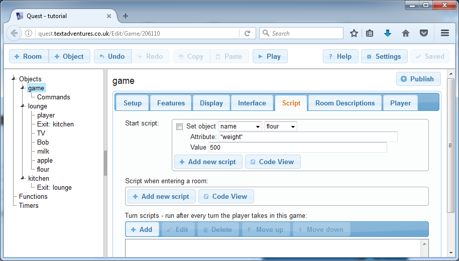
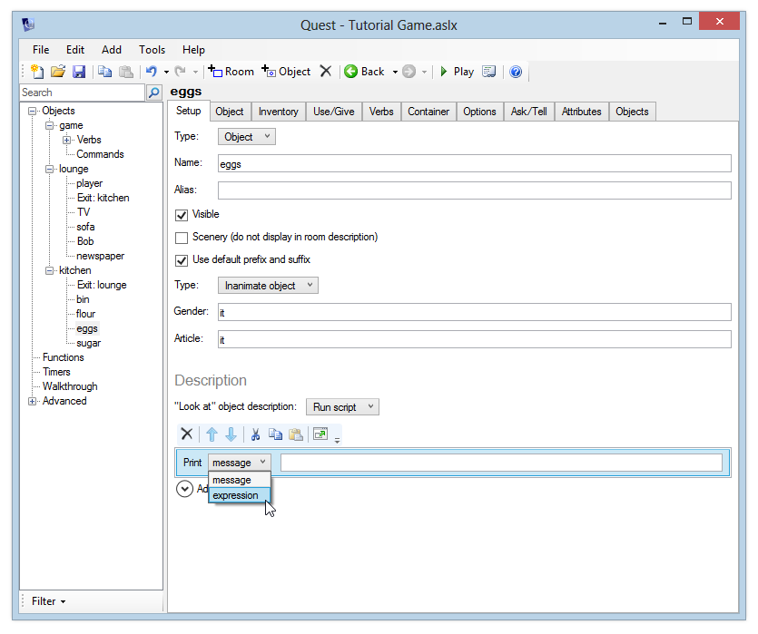

We'll now start creating things in the kitchen, where we'll look at some more of Quest's features.

Enter a description like "The kitchen is cold and the stench of the overflowing bin makes you feel somewhat faint." As an exercise, add a scenery object called "bin" and give it a sensible description.

We're now going to look at **attributes**. Every time we've edited any aspect of an object or room so far, we've actually been editing an attribute. The prefix, description, "take" behaviour and so on are all attributes of an object. Whenever something changes in ther game, it is a change in an objects attribute. When the TV is turned on or off, the "switchedon" attribute is changing. Even when the player moves, this is actually just changing an attribute of the player object called "parent".

The Attributes Tab
------------------

If you are using the desktop version, you can click an object and select the Attributes tab - you'll see all the underlying data for the object.

We can also use the Attributes tab to add our own custom data to any object. In this example, we'll store the weights of various objects by creating a new "weight" attribute. Later we will create a "weigh" command which will tell us the weight of **any** object.

First, let us create a few objects we can weigh. Create three objects – flour, eggs and sugar. Make sure the object types are set correctly (either "inanimate object" or "inanimate object (plural)").

Now let's give them weights. We'll use units of grams, so we'll say the flour has a weight of 500, the eggs have a weight of 250, and the sugar has a weight of 1000.

**Desktop version** First we'll set the flour's "weight" attribute to 500. To do this, select the flour object and go to the Attributes tab. We'll look at "Inherited Types" later - for now, go to the Attributes table and click the Add button. Enter the name "weight". We want to to use whole numbers for weight values, so select "Integer" from the list and enter the value "500".

Alternatively...
-------------

The Web version curently has no attributes tab, so we will have to use an alternative approach. Go to the Script tab of the game object. The bit at the top is a script that will run when the game starts, so we can set attributes there (the disadvantage is that this will get pretty messy if you have dozens of objects with a few attributes each, but for a handful, it is okay).

Click "Add new script", and select "Set a objects attribute (named by an expression)" from the "Variables" category. In the first line, keep "Name", and in the other box, select the flour. For the next line, set the attribute name to "weight" (note that for once you need quotes here, but there are already provided). In the third line, for the value type "500".
     

Now follow the same process to set the weights of the eggs and the sugar.

Reading Attributes
------------------

You can read an attribute from any script command by using an **expression**. Expressions let you perform calculations, run functions, and read the values of variables and attributes. To read an attribute, you use this form:

     object.attribute

For example, to read the weight of the eggs, you would type:

     eggs.weight

Let's update the "look at" description of the eggs, as an example. Select the eggs object, and then under the "Setup" tab, change the "Look at" description to "Run script". Add the "print a message" command. Now, instead of printing a normal message (which would never change, and can't read attributes), we want to print the result of an expression. So, click the "message" drop-down and select "expression" instead.

Enter this expression exactly, including the quotation marks in the correct place:

     "A box of eggs, weighing " + eggs.weight + " grams."

This will insert the value of the "weight" attribute in our text.

Always make sure that your object and attribute names match the expression exactly - it is recommended that you always use lower-case object and attribute names, as these names are case-sensitive.

Launch the game and verify that the correct response is displayed – it should read "A box of eggs, weighing 250 grams."

Of course, we could have just manually entered this into the description of the eggs anyway – we didn't really need to use an attribute. The real power of this, though, is that you can easily change attributes while the game is running. We could change the "weight" attribute of the eggs for example, if the player used some of them to bake a cake (but, er, hopefully you'll have some slightly more exciting ideas for things that players can do in *your* game). After the attribute is updated, our "look" description would automatically reflect the current weight of the eggs.

[Next: Custom commands](custom_commands.html)