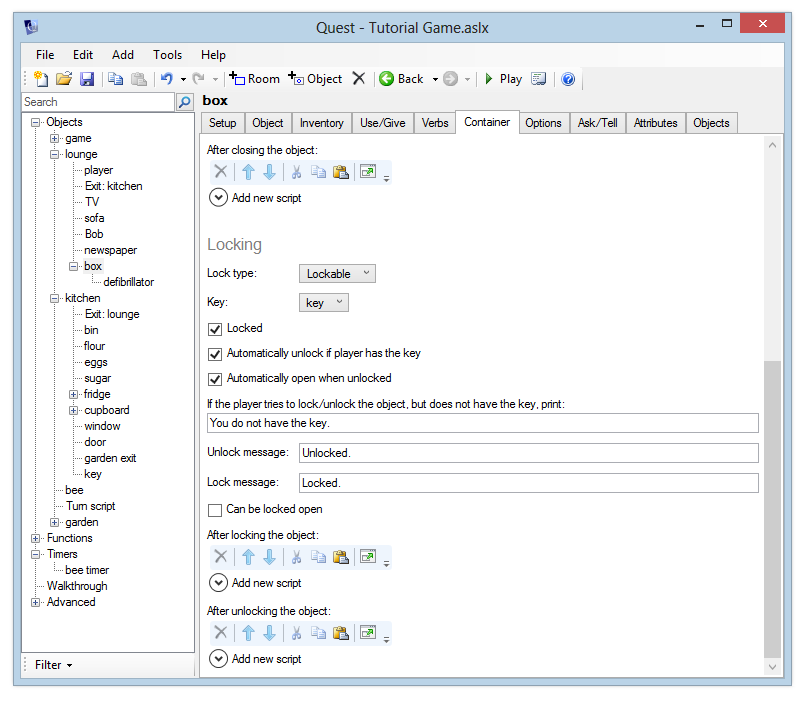

We've already covered [using containers](using_containers.html), but what if you don't want the container to be immediately openable? If it's part of a puzzle, you may want the player to have a particular "key" object before they can open it. To implement this, you can make the container lockable.

Let's create a small (and, admittedly, tedious) puzzle - we're going to put the defibrillator in a locked box. The player must get the key from the kitchen, unlock the box, and then take the defibrillator from the box before they can revive Bob.

Please bear in mind this is probably the most boring puzzle imaginable. It is just an example. Don't use it as a guide for something that would make your game more exciting - it's up to you to think of interesting puzzles!

First, set up the objects:

-   create a "box" object in the lounge. Make it a closed container.
-   move the "defibrillator" object to the box (you can click and drag in the tree in the Windows version, or if you're using the web version you can select the defibrillator and then click the Move button in the top-right of the screen)
-   in the kitchen, add a "key" object, and make it takeable.

Now, make the box lockable. Go to the Container tab and in the "Locking" section, choose "Lockable" from the lock types list. This will display the lock options. You can now choose the "key" object from the list.

By default we have the "Automatically unlock if player has the key" and "Automatically open when unlocked" options turned on. This is out of politeness to players really, as there's no need to force them to jump through hoops and perform additional steps - if they've unlocked the object, it's a fair bet they want to open it, and if they type "open box" before unlocking it, then if they have the key, there's no point in forcing them to type "unlock box" first.

It might be a good idea to tick the "List children when object is looked at or opened" option, in the main Container options. Now your game output will look like something this:

     > open box
     It is locked.
     
     > unlock box
     You do not have the key.
     
     > s
     You are in a kitchen.
     [rest of kitchen description snipped...]
     
     > take key
     You pick it up.
     
     > n
     You are in a lounge.
     [rest of lounge description snipped...]
     
     > unlock box
     Unlocked.
     You open it.
     It contains a defibrillator.

[Next: Using lockable exits](using_lockable_exits.html)     
