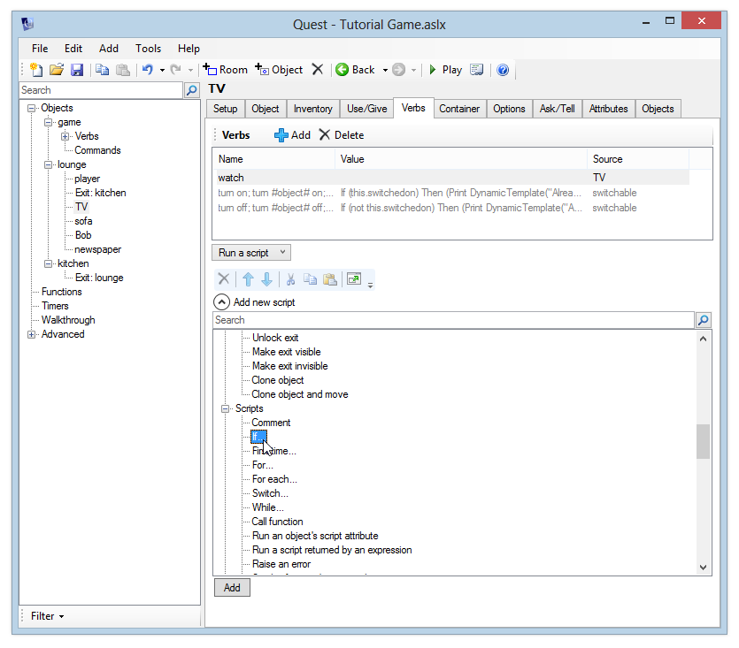
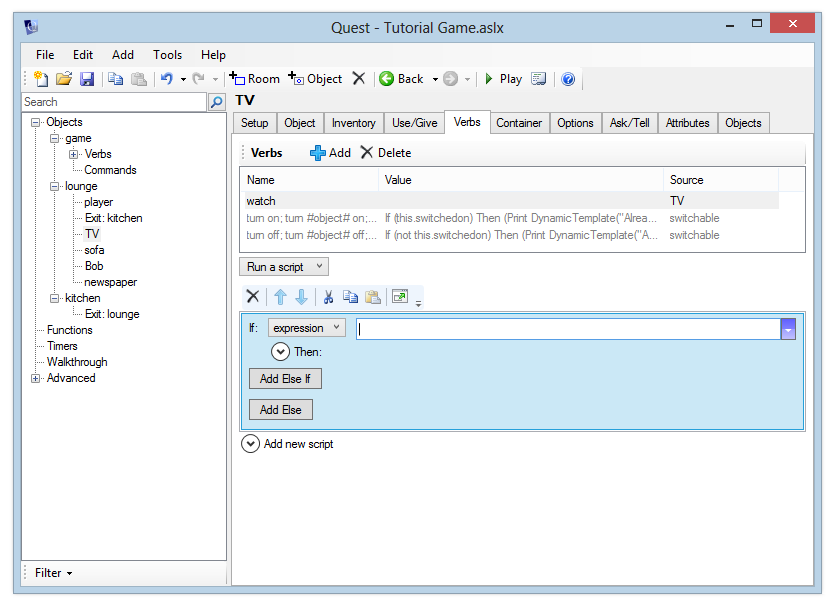
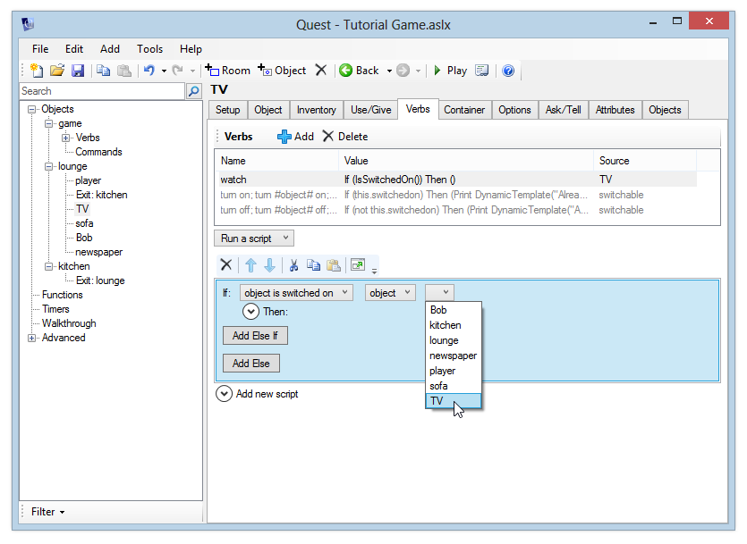
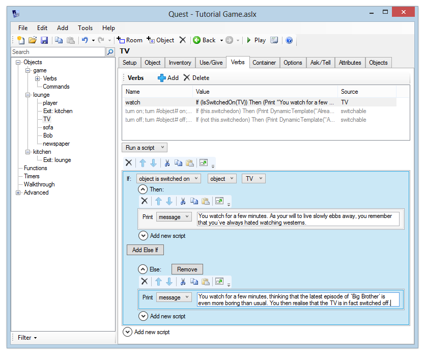

We'll now start to play with the real power behind Quest – scripts. Scripts let you do things within the game, change the game world, show pictures and more. With a script, you can print different messages or run other actions depending on the state of any object in the game.

In this example, we'll use a script to customise the "watch" verb we added to the TV in the previous section. We want to update it to provide a sensible response depending on whether the TV is switched on or not.

Select the TV object and go to the Verbs tab. If you've been following all the steps in this tutorial, you should already have a "watch" verb which prints a message. If you've already got a "watch" verb, change it from "Print a message" to "Run a script" (or add a new "watch" verb if you don't already have one).

Click the "Add new script" header and you'll see a list of all the commands you can add to a script. The commands are in broad categories - Output, Objects, Variables and so on - but you can also find a command in the desktop version by typing in the Search box, if you don't know the category.

Go to the Scripts category and add the "If" command. You can click the "Add" button, or just double-click the command in the desktop version. In the web version, click the "Okay" button. The most used scripts have their own buttons across the top of the dialogue, so you can also click that.

The "if" command is hugely powerful, because it lets us choose which script to run depending on a condition that we set.

After adding the command, you'll see the following editor:

First, we need to add a condition. If you click the "expression" dropdown list next to the "If" label, you'll see a list of conditions that you can add. Select "object is switched on".

The editor template will then change, and next to the condition you will now see two more drop-down lists. Leave the first one set to "object", and you'll be able to choose an object from the second list. Select "TV".

That's our condition added - now we just need to say what happens when the condition is met. Click the "Then" header and you'll see that you can add script commands here too. These script commands will *only* be run *if* the TV is switched on. Add a "Print a message" command.

This will be the text that will appear when the player types "watch tv" while the TV is switched on, so enter a message like "You watch for a few minutes. As your will to live slowly ebbs away, you remember that you’ve always hated watching westerns."

We're not done yet - what if the TV is *not* switched on? Fortunately we don't need to add a whole other condition - we can just add an "Else" script to the one we're working on. Click the "Add Else" button, then expand the "Else" header that appears. Add a "Print a message" command again, and this time add a message like "You watch for a few minutes, thinking that the latest episode of ‘Big Brother’ is even more boring than usual. You then realise that the TV is in fact switched off."

Your screen should now look like this:

Note that both the "Then" part and the "Else" part are indented; this lets you know exactly what scripts are included - you might have many scripts there (and even other "If" scripts). 

Now would be a good time to play the game to test that it works properly. Switch the TV on and off, and verify that you get a sensible response when you type "watch tv".

[Next: Showing a map](showing_a_map.html)