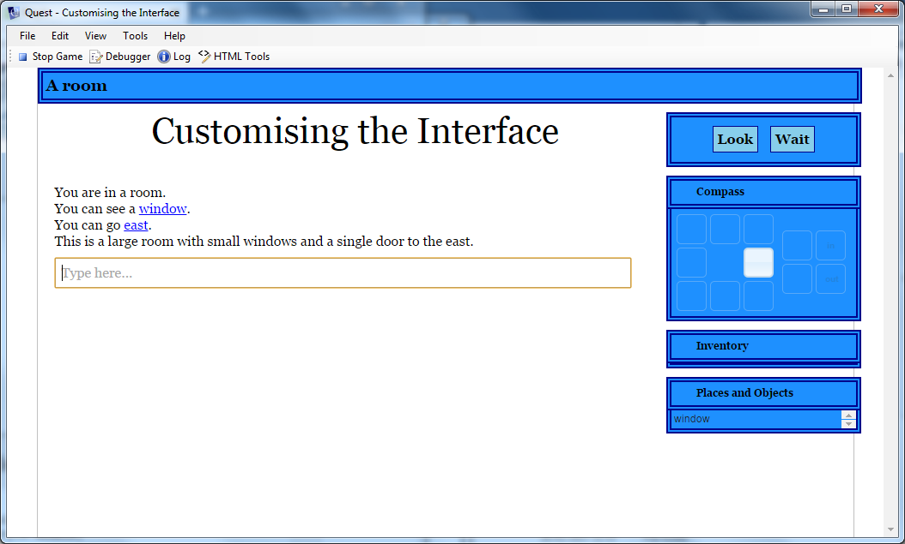
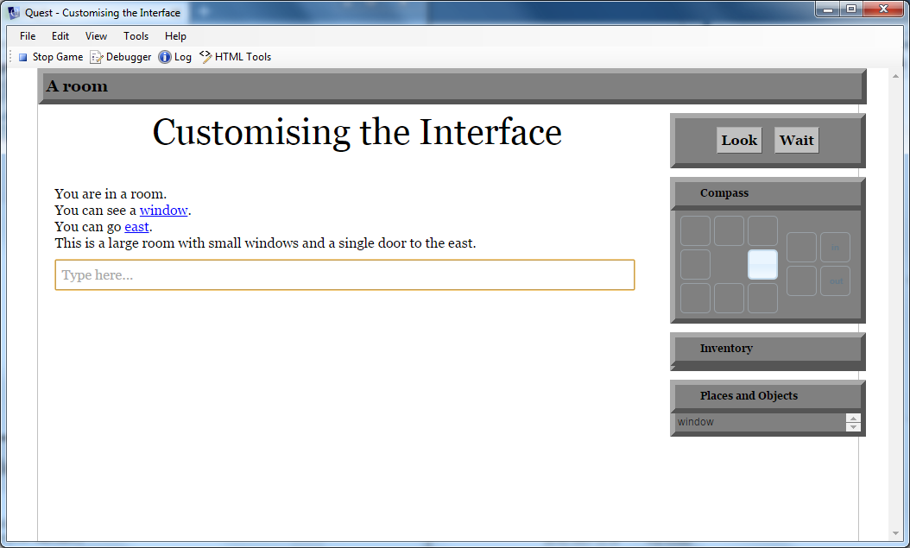

Customisation in Action
-----------------------

In this section we will modify the status bar and game panes to get a feel for how to approach it and some of the issues that can be encountered. We will go for an old-fashioned look, in brown. This is what we are aiming for:


The first thing to do is to decide what we want, and how that is described in CSS. we can then assign the CSS values to some string variables. Most of what we will do is change the background colour and the border, so we start there:

```
backandborder = "border: chocolate ridge 6px;background:sandybrown"
```

I want to include a command panel, and to have the buttons stand out a bit, so here is the CSS for the buttons:

```
button = "padding:5px;background:BurlyWood;border:ridge chocolate 1px;"
```

I want the text in a certain colour and font.

```
text = "color:black;font-family:georgia, serif"
```

To set the status bar at the top isnow easy:

```
JS.setCss ("#status", backandborder)
```

To set the panes on the right, we can modify to classes, one used for the header and one for the content. I also want square corners, so will be adding to the CSS. Oh, and the content should not have a border at the top because it has the one from the bottom of the header.

```
JS.setCss (".ui-accordion-header", "border-radius: 0px;" + backandborder)
JS.setCss (".ui-accordion-content", "border-radius: 0px;" + backandborder + ";border-top:none")
```

Then we can modify the text style:

```
JS.setCss (".accordion-header-text", text)
```

The orange triangles are awkward to change, so we will just hide them. Why actually clicks on them?

```
JS.setCss (".ui-icon", "display:none")
```

Then we can add the command pane, and modify its style (note the text colour must be set in the first step). we can also set up the buttons to stand out (if you have different commands here you will need to alter or add as required).

```
JS.setCommands ("Look;Wait", "black")
JS.setCss ("#commandPane", text + ";" + backandborder)
JS.setCss ("#verblinkwait", button)
JS.setCss ("#verblinklook", button)
```

Finally, because the borders are much wider, we need to space things out a bit more:

```
JS.setCss ("#gamePanes", "margin-top: 16px")
JS.eval ("$('#gamePanes').width(227);")
```

Here is the whole thing:

```
backandborder = "border: chocolate ridge 6px;background:sandybrown"
button = "padding:5px;background:BurlyWood;border:ridge chocolate 1px;"
text = "color:black;font-family:georgia, serif"
JS.setCss ("#status", backandborder)
JS.setCss (".ui-accordion-header", "border-radius: 0px;" + backandborder)
JS.setCss (".ui-accordion-content", "border-radius: 0px;" + backandborder + ";border-top:none")
JS.setCss (".accordion-header-text", text)
JS.setCss (".ui-icon", "display:none")
JS.setCommands ("Look;Wait", "black")
JS.setCss ("#commandPane", text + ";" + backandborder)
JS.setCss ("#verblinkwait", button)
JS.setCss ("#verblinklook", button)
JS.setCss ("#gamePanes", "margin-top: 16px")
JS.eval ("$('#gamePanes').width(227);")
```

Because we set up strings at the start, we can change the first two lines to see some dramatic differences...

```
backandborder = "border: darkblue double 6px;background:dodgerblue"
button = "padding:5px;background:skyblue;border:double darkblue 1px;"
```




```
backandborder = "border: darkgrey outset 6px;background:grey"
button = "padding:5px;background:silver;border:outset darkgrey 1px;"
```




```
backandborder = "border: Indigo dotted 6px;background:MediumPurple"
button = "padding:5px;background:Violet;border:dotted Indigo 1px;"
```


