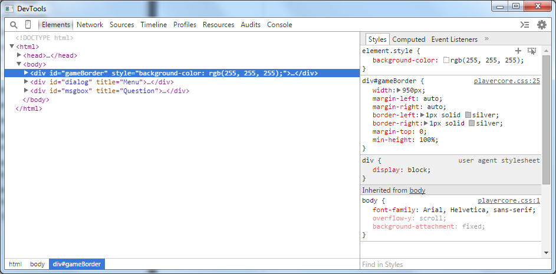

Elements
--------

Bits of an HTML page are called elements, and "gameBorder" is just one of them. All HTML documents have an "html" element that contains everything else, and inside that it has a "head" and a "body" elements. Quest then has a few dozen elements that make up the interface inside the "body" element.

You can look at those elements as you play a game. In the off-line editor, click on HTML Tools; on-line, your browser will probably have the facility to do this too. On the left you will see a hierarchy of elements (you will need to expand them to see them all), and on the right a list of properties. Click on an element, and it will be highlighted in your game so you can see what it refers to.

Most of the interesting elements are of the type "div", and each is identified by an "id". The gameBorder one looks like this:




CSS Properties and Values
-------------------------

There are a large number of CSS properties, to get a full list, use the internet. I will mention just some of the interesting ones. You do need to be careful that you supply the right type of value, but we will look at that too. Also, be aware that CSS uses America spelling for "center" and "color".

As of version 5.7, Quest has `JS.setCss` for setting CSS properties.

### color

The colour of text is determined by the "color" property (note American spelling). You can set colours in a number of ways, the easiest is to use a name. This [Wiki page](http://en.wikipedia.org/wiki/Web_colors) has a full list of available names (note that there are no spaces in the name; for once, capitalisation does not matter):
```
  JS.setCss("#gameBorder", "color:blueviolet;")
```
You can also set colours by using the RGB code. These both set the colour to red.
```
  JS.setCss("#gameBorder", "color:rgb(255, 0, 0);")
  JS.setCss("#gameBorder", "color:#ff0000;")
```
Each splits colours in to three components: red, green, blue. In the first, each component is a number from 0 to 255. In the second, it is a hexadecimal number from 00 to ff. If you do not know what hexadecimal is, use the other format.


### background-color

This works just the same as color, but changes the background for this element.
```
  JS.setCss("#gameBorder", "background-color:blueviolet;")
```

### background-image

You can set the background image for each element. The CSS requires that the image name go inside a url function call, and to ensure it works on-line, Quest requires the name go inside a GetFileURL, so it gets complicated:
```
  JS.setCss("#gameBorder", "background-image:url(" + GetFileURL("gravestone.png") + ");")
```
The status bar at the top uses an image. If you want to stop that image displaying, do this:
```
  JS.setCss("#status", "background-image:none;")
```

### width

This will change the width of the element. You have the potential to mess up big time here, so change one element at a time and see what happens. Elements do impact on each other, so you may not see any difference. When experimenting, change the width of Quest itself (or the browser) to see what effect that has too.

Note that the value must include "px", which says the units are pixels.
```
  JS.setCss("#gameBorder", "width:950px;")
```

### opacity

The opacity property defines how much this element covers the one below (the reverse of transparency). It can range from 0.0 (this element is not visible) to 1.0 (this element is completely opaque).
```
 JS.setCss("#gameBorder", "opacity:0.5;")
```

### border

The border property lets you set borders. You can set various aspects in one go, so in this example a dashed line, 5 px wide and blue, will be added.
```
  JS.setCss("#gameBorder", "border:dashed 5px blue;")
```
The status bar at the top has a blue border. If you want to remove it, do this (also set the width to 950px to keep it aligned):
```
 JS.setCss("#status", "border:none;")
```

Awkward Attributes (The Command Bar)
-----------------------------------

Some attributes are difficult to change, and the usual technique just does not work. A good example is the border of the command bar. The element's ID is `txtCommand`, and it has `border` and `outline` properties, but if you set them to "none", it does not work. Why not? No idea.

However, there is a way around - on the desktop anyway. If you go into full code view (press F9), you can add an attribute to the XML of the game object that includes CSS.
```
    <css><![CDATA[
      <style>
        #txtCommand {
          outline:none;
          border: none;
        }
      </style>
    ]]></css>
```
Be careful how you do that; I would suggest pasting it below this line:
```
    <firstpublished>2016</firstpublished>
```
You can output that in game.start, and it should now make the required change.
```
JS.addText (game.css)
```

As of Quest 5.7, you can turn off the border on the _Interface_ tab of the game object, but there may well be other elements that need to be handled like this, for example....

### Inventory Items

This technique will also allow you to change how inventory items are displayed. They do not have IDs, they uses classes instead, `ui-selectee` (for all objects in the list), `ui-selected` (for the selected one) and `ui-selecting` (for the selected one whilst clicked). The difference is that only one element on the page can have a specific ID but any number can have a class. You specify a class by using a `.`, rather than a `#`.

This example will alter the background colour when an item is selected.
```
    <css><![CDATA[
      <style>
        .ui-selected {
          background-color: darkblue;
          color: white;
        }
        .ui-selecting {
          background-color: blue;
          color: white;
        }
      </style>
    ]]></css>
```

In [part 3](ui-javascript3.html) we will discuss testing and look at some specific tricks.
